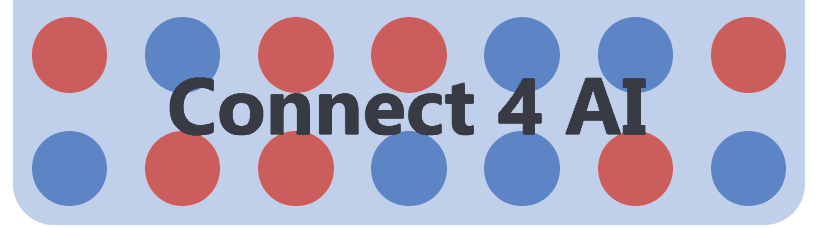
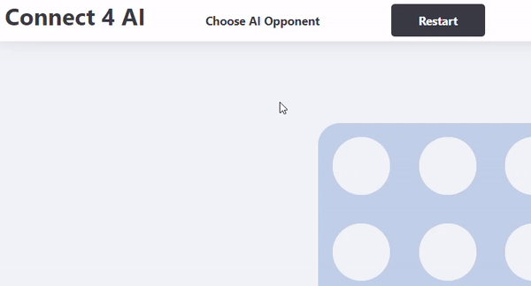
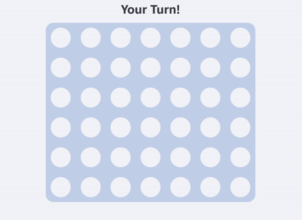
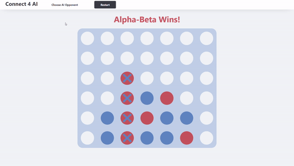

# [Connect 4 AI](https://rdey0.github.io/connect4_ai/)

    
    
    
    
    
    

<h1></h1>

## [Demo](https://rdey0.github.io/connect4_ai/)

## Description

Play connect 4 against game search algorithms of varying difficulty.

## How to Play

### Rules

Connect 4 is a two player, turn based game played on a 7x6 board. Each turn, a player chooses a column on the board to make a move; A piece is then dropped into the chosen column and settles on the lowest empty space on the board. The goal for each player is to form a straight line of four of their own pieces either vertically, horizontally, or diagonally. The first to do this wins.

### Guide

1. Select your Opponent: Click on "Choose AI Opponent" to select the AI algorithm you want to play against. You can change the opponent algorithm at any point in the game without resetting the board.

 

    

 

2. Make a Move: Hover over a column and click to make a move.

 

    

 

3. Restart the Game: You can reset the board at any point in the game by clicking the "Restart" button. The first player will be alternated on each board reset

 

    

 

## How it Works

This web application was created with React and the AI algorithms were written in JavaScript. Animations were keyframed with CSS.

## AI Algorithms

### Mostly Random

As the name suggests, this AI mostly makes moves at random. The only time this AI doesn't make random moves is when it senses and responds to imminent victory or defeat.

### Monte Carlo

This algorithm will simulate random games to completion starting from the current board state and will select the move which resulted in the most wins and fewest losses.

### Minimax

Minimax exhaustively searches all board states n moves ahead of the current board state and then evaluates them based on a heuristic (essentially a metric of how favorable the board state is). Minimax seeks to minimize it's potential loss and maximize it's potential gain.

### Alpha-Beta

Alpha-beta is very similar to minimax except it doesn't search states which a competent opponent would never make (like voluntarily setting up a 4-in-a-row). By refusing to search these states, Alpha-beta is able to 'think' much faster, allowing it to search more moves in advance than minimax.

### Adaptive Depth Heuristic (ADH)
ADH is similar to alpha-beta except it changes its heuristic function and progressively increases its search depth (the amount of moves it is thinking in advance) as the game continues.

